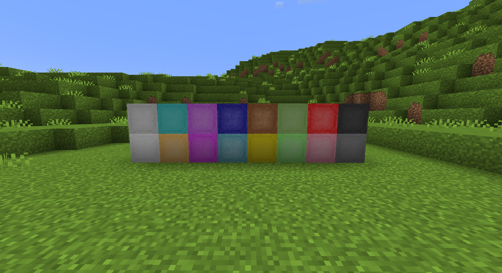
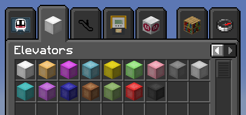
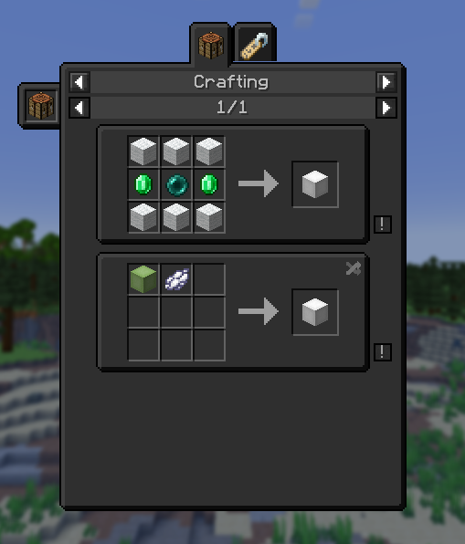

# AnotherSimpleElevator


[](https://modrinth.com/mod/ase)
[](https://fabricmc.net/)
[](https://quiltmc.org/)

Just another elevator mod for Minecraft. Simple yet useful.

## Description

AnotherSimpleElevator is a Minecraft mod that adds one-block, instant elevators to the game. Jump to teleport up and
sneak to teleport down.

This mod adds elevators in all dyeable colors from the game. It also allows configuring a range that must be satisfied
between elevators or whether it is allowed to place carpets on the elevators and more. Right-click the elevator to set
the
player's facing direction after teleporting. Look below for screenshots and crafting recipe.







## Config

The mod uses a JSON config file located at `config/ase.json`. The config below presents default values and property
descriptions.

```jsonc
{
  "range": 20, // in what range the next elevator will be searched
  "center_pitch_on_tp": true, // center player pitch on teleportation
  "allow_carpets_on_elevator": true, // should elevators work with carpets on them
  "play_use_sound": true, // whether a whoosh sound should be played on elevator use
  "elevator_not_found_msg": false // whether a message should appear for a player when next elevator isn't found
}
```

## Downloading and Usage

You can download this mod from [Modrinth](https://modrinth.com/mod/ase),
from [releases tab](https://github.com/krystejj/anothersimpleelevator/releases) in this repository or using your
favorite launcher that supports [Modrinth](https://modrinth.com/). Place the downloaded `ase-x.x.x.jar` file in
the `mods` folder of your Minecraft client or server.

This mod is required on both client and server side. It works with [Fabric](https://fabricmc.net/)
and [Quilt](https://quiltmc.org/) loaders in Minecraft versions
starting from 1.20. When used with Fabric loader, it requires [Fabric API](https://modrinth.com/mod/fabric-api/) and
with Quilt loader, it requires [Quilted Fabric API](https://modrinth.com/mod/qsl).

[](https://modrinth.com/mod/fabric-api/)
[](https://modrinth.com/mod/qsl)

## License and Credits

This mod is licensed under MIT, free and open source license. For more info, check the [license file](./LICENSE.md).

Thanks to [VsnGamer](https://github.com/VsnGamer) for maintaining [ElevatorMod](https://modrinth.com/mod/elevatormod)
💗.
